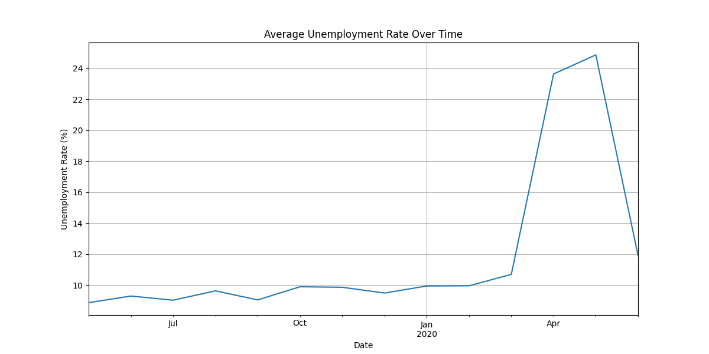
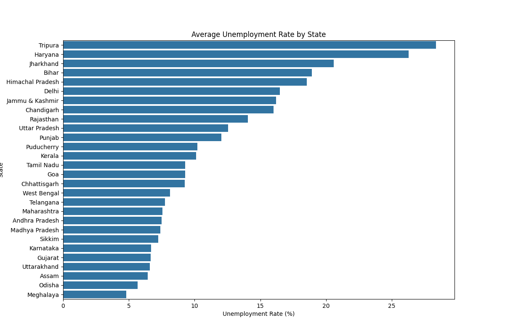
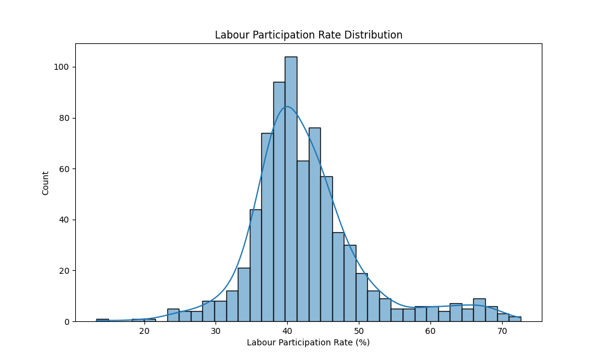
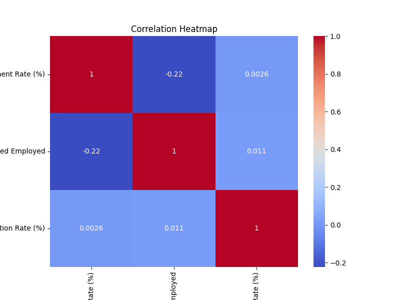
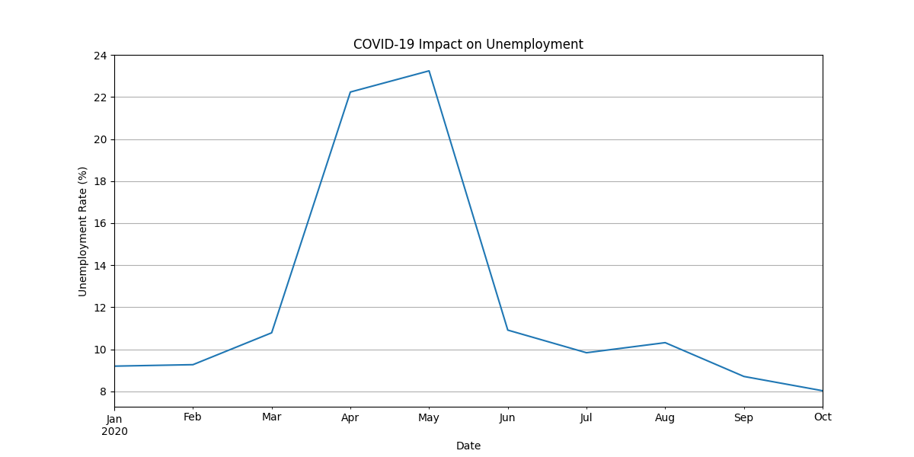

# 📊 Unemployment Analysis in India using Python


---

# 📌 Project Overview

This project was completed as part of the **CodeAlpha Data Science Internship**.

The objective of this project is to analyze unemployment trends in India using Python and data visualization techniques. The analysis helps understand unemployment patterns across states, labour participation trends, and the impact of COVID-19 on employment.

---

# 🎯 Objectives

* Load and clean unemployment datasets
* Perform Exploratory Data Analysis (EDA)
* Analyze unemployment trends over time
* Compare unemployment rates across states
* Study labour participation rates
* Understand the impact of COVID-19 on employment
* Generate meaningful visualizations and insights

---

# 📂 Dataset Information

Two datasets were used:

### 1. Unemployment in India.csv

Contains:

* Region (State)
* Date
* Estimated Unemployment Rate (%)
* Estimated Employed
* Estimated Labour Participation Rate (%)
* Area (Urban/Rural)

### 2. Unemployment_Rate_upto_11_2020.csv

Contains unemployment data specifically focused on the COVID-19 period.

---

# 🛠️ Technologies Used

* Python
* Pandas
* NumPy
* Matplotlib
* Seaborn

---

# 📊 Data Analysis Workflow

```text
Data Collection
      ↓
Data Cleaning
      ↓
Exploratory Data Analysis
      ↓
Visualization
      ↓
Trend Analysis
      ↓
Insight Generation
```

---

# 🧹 Data Cleaning

The following preprocessing steps were performed:

* Removed unnecessary spaces from column names
* Converted Date column into datetime format
* Checked for missing values
* Generated statistical summaries

Example:

```python
df.columns = df.columns.str.strip()
df['Date'] = pd.to_datetime(df['Date'])
```

---

# 📈 Visualizations

## Unemployment Trend Over Time

Shows how unemployment rates changed across different periods.



---

## State-wise Unemployment Analysis

Compares average unemployment rates among Indian states.



---

## Labour Participation Distribution

Displays the distribution of labour participation rates.



---

## Correlation Heatmap

Shows relationships among numerical variables.



---

## COVID-19 Impact Analysis

Highlights unemployment trends during the COVID-19 period.



---

# 🔍 Key Insights

### Insight 1

Unemployment rates increased significantly during the COVID-19 lockdown period.

### Insight 2

Certain states consistently recorded higher unemployment rates compared to others.

### Insight 3

Labour participation rates varied considerably across regions.

### Insight 4

Economic disruptions had a noticeable effect on employment trends in 2020.

---

# 📋 Statistical Analysis

The project includes:

* Dataset overview
* Missing value analysis
* Descriptive statistics
* State-wise comparison
* Time-series analysis
* Correlation analysis

---

# 📁 Project Structure

```text
CodeAlpha_Unemployment_Analysis
│
├── unemployment_analysis.py
├── Unemployment in India.csv
├── Unemployment_Rate_upto_11_2020.csv
├── requirements.txt
├── README.md
│
└── screenshots
    ├── unemployment_trend.png
    ├── state_unemployment.png
    ├── labour_participation.png
    ├── correlation_heatmap.png
    └── covid_unemployment.png
```

---

# ⚙️ Installation

Clone the repository:

```bash
git clone https://github.com/vansh3452/CodeAlpha_Unemployment_Analysis.git
```

Move to project directory:

```bash
cd CodeAlpha_Unemployment_Analysis
```

Install dependencies:

```bash
pip install -r requirements.txt
```

Run the project:

```bash
python unemployment_analysis.py
```

---

# 🚀 Future Improvements

* Interactive dashboards using Plotly
* Streamlit deployment
* State-wise forecasting models
* Time-series prediction
* Real-time employment data integration

---

# 🧠 What I Learned

Through this project I learned:

* Data Cleaning
* Data Visualization
* Exploratory Data Analysis (EDA)
* Correlation Analysis
* Trend Analysis
* Python for Data Science
* Real-world Dataset Handling

---

# 📜 Internship Task

**CodeAlpha Data Science Internship**

Task 2: Unemployment Analysis with Python

---

# 👨‍💻 Author

**Vansh Gupta**

Data Science Intern @ CodeAlpha

GitHub: https://github.com/vansh3452

LinkedIn: https://linkedin.com/in/YOUR_PROFILE

---

⭐ If you found this project useful, consider giving it a star.
